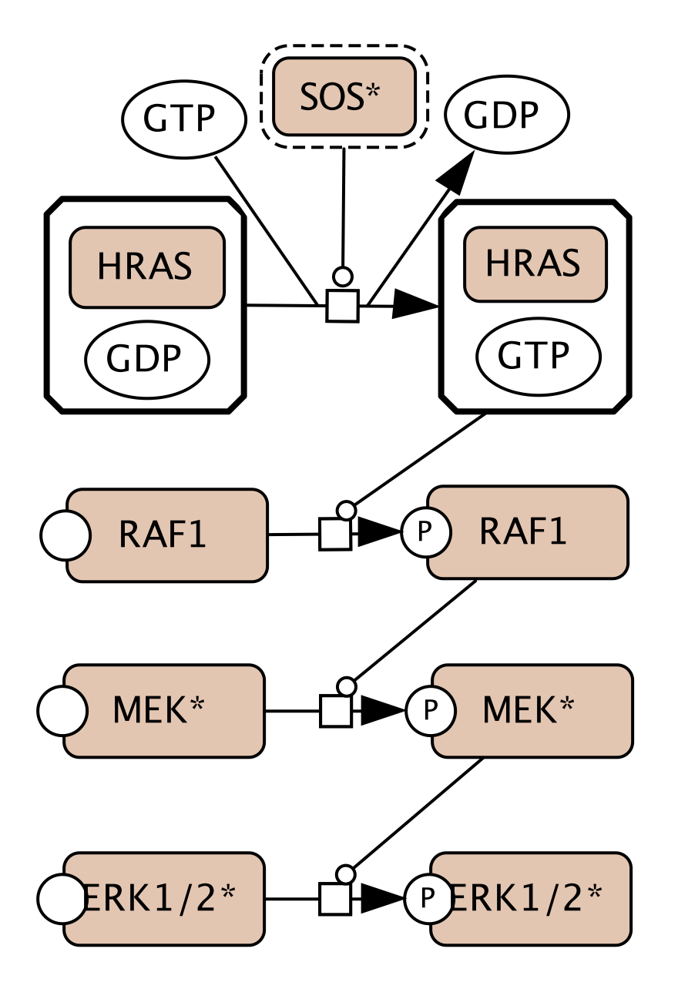
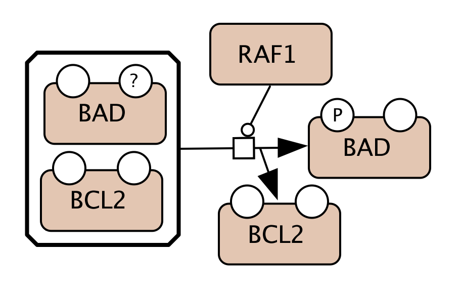
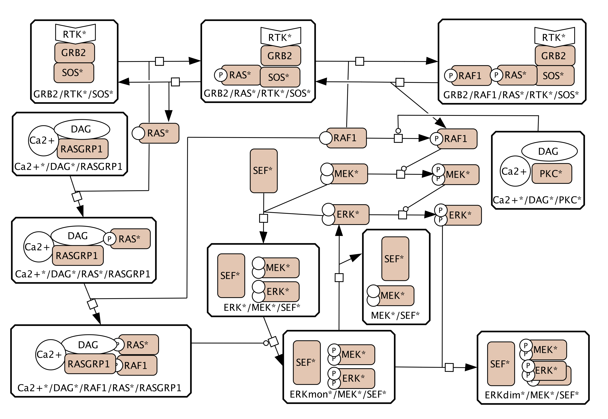
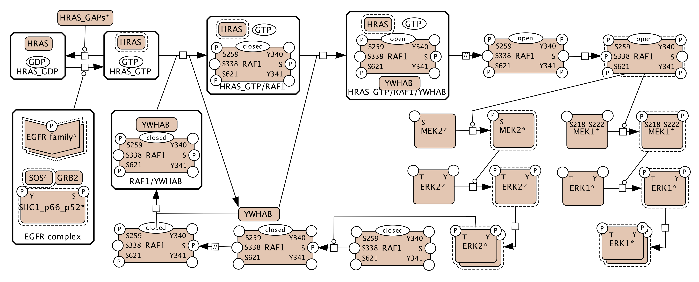

# ACSN collection

**Figure 1. The representation of the RAS–RAF–MEK–ERK pathway in the Atlas of Cancer Signalling Networks:**  
(A) The RAS–RAF–MEK–ERK part of the Adaptive Immunity, the Innate Immunity and the Cancer-Associated Fibroblasts maps;  
(B) RAF1 from the Apoptosis module of the Regulated Cell Death map;  
(C) the MAPK part of the Cell Survival map;  
(D) the RAS–RAF–MEK–ERK part of the EMT and Senescence map.  

(A)
 

(B)
 

(C)
 

(D)
 

## Reference
Mazein A, Rougny A, Karr JR, Saez-Rodriguez J, Ostaszewski M, Schneider R. Reusability and composability in process description maps: RAS-RAF-MEK-ERK signalling. Brief Bioinform. 2021 Apr 8:bbab103. [doi: 10.1093/bib/bbab103](https://doi.org/10.1093/bib/bbab103). Epub ahead of print. [PMID: 33834185](https://pubmed.ncbi.nlm.nih.gov/33834185/).
