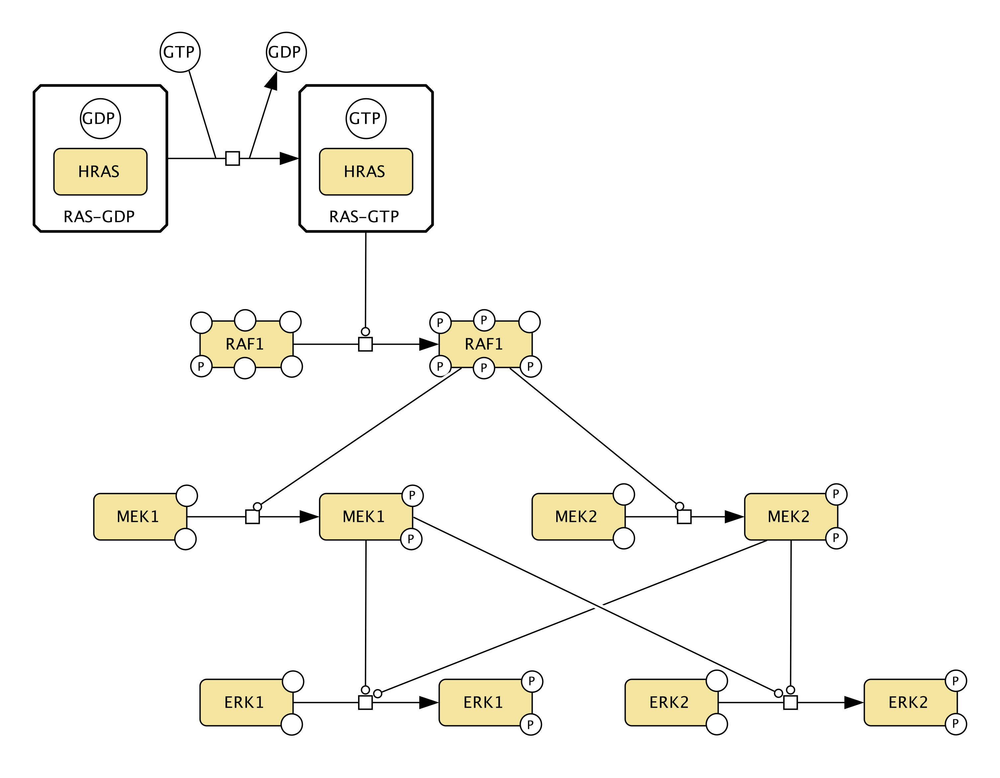

## canonical-m01v01: HRAS-RAF1-MEK1/2-ERK1/2

  

**Creators:** Alexander Mazein

**Description:** Text  

**Input:** HRAS, GTP, p-RAF1, MEK1/2, ERK1/2  
**Output:** pp-ERK1/2, GDP  

**Key references**  

Text

## canonical-m02v01: HRAS-RAF1-MEK1/MEK2-ERK1/ERK2

**Creators:** Alexander Mazein

**Description:** Text  

**Input:** HRAS, GTP, p-RAF1, MEK1, MEK2, ERK1, ERK2  
**Output:** pp-ERK1, pp-ERK2, GDP  

**Key references**  

Text

